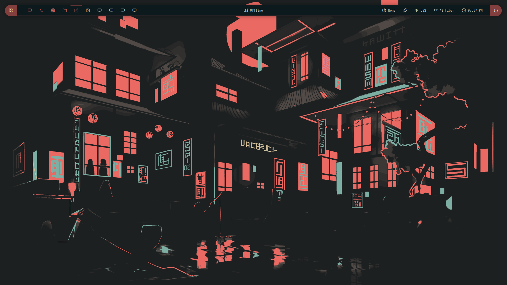

# BerryWM Nordic Rice – Dotfiles by Aditya Yadav

A clean, fast, and practical BerryWM rice using diffrent aesthetic themes with modular configs, Rofi launcher, Polybar, and flame-powered keybinds. Tuned for real-world daily usage.

(BTW)[Please Paste everything from the wallpapers folder to ~/Wallpapers for theme swithing to work perfectly.]

---

## Screenshots

#### Catppuccin Mocha


#### Everforest


#### Gruvbox


#### Nord


#### Tokyo Night


#### Redflare


#### Pastel 


---

## SXHKD Keybindings (Raw)

```bash
# ┌──────────────────────────────────────────────────────────────┐
# │ © 2020-2025 Aditya Yadav <geltron103@gmail.com>              │
# │ Licensed under GNU-GPL3. You are free to copy, modify, and   │
# │ redistribute under the same license.                         │
# └──────────────────────────────────────────────────────────────┘

##---------- Keybindings for berry ----------##

# Terminal (kitty)
super + Return

##---------- Rofi Launcher & Menus ----------##

# Rofi App Launcher
super + d

# Screenshot
super + alt + s

##---------- Applications ----------##

# Launch Apps
super + {f,w,e}
	{gedit,firefox,nautilus}

# Lockscreen
ctrl + alt + l

# Reload sxhkd configuration file
super + Escape

##---------- Berry Hotkeys --------##

#Resize Windows
super + shift +  {Left, Down, Up, Right}

#Move Windows
super + ctrl + {Left, Down, Up, Right}

#Snap Left
super + Left

#Snap Right
super + Right

#Maximize Window
super + Up

#Minimize Window
super + Down

#Switch Workspaces
super + {1-9}

#Move window to workspaces
super + shift + {1-9}

#Fullscreen a window
super + space

#Move Focus
super + Tab

#Center widnow
super + q

#Close Widnow
super + c

#Force Close a window
super + shift + c
	
#Quit BerryWM
super + shift + q

#Theme Switcher Menu
super + shift + t
    bash ~/.config/berry/scripts/berry-theme-switcher.sh

# Wallpaper Switcher
super + b
    change wallpaper 

